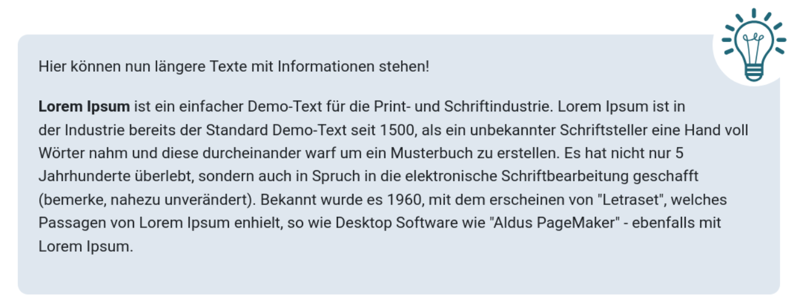
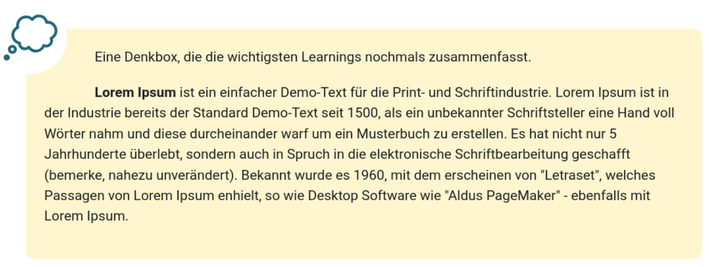
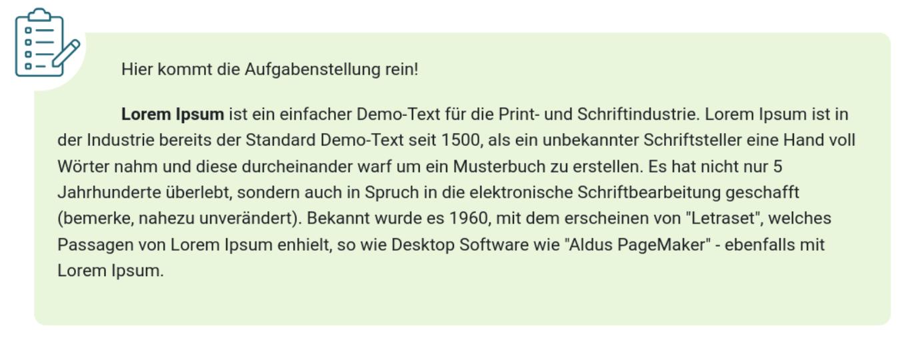
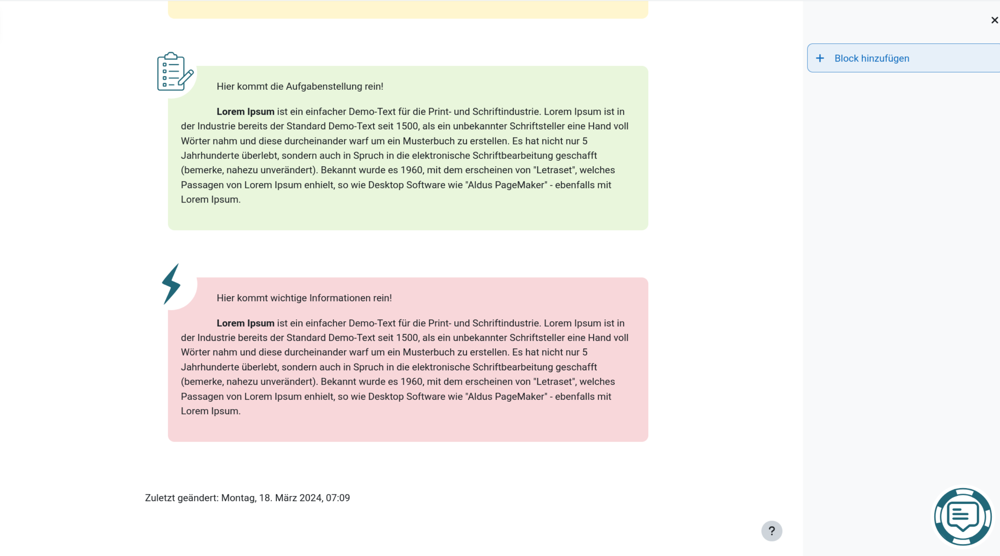
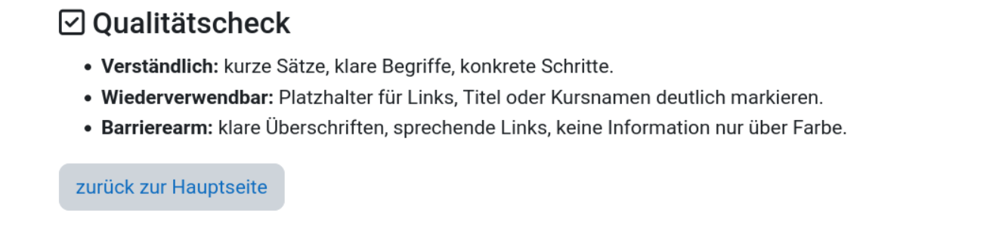

# Boxen in Moodle

Diese Vorlage zeigt einfache Boxen und Buttons, die direkt in Moodle eingefügt werden können.

So arbeiten Sie am einfachsten:

1. Öffnen Sie in Moodle den HTML-Editor oder den Modus für einfachen Text.
2. Kopieren Sie den gewünschten HTML-Code aus dieser Seite.
3. Ersetzen Sie die Beispieltexte durch Ihre eigenen Inhalte.
4. Prüfen Sie nach dem Einfügen, ob Bild, Abstand und Text auf der Kursseite sauber dargestellt werden.

## 🟦 Tippbox

Einsatz: für Hinweise, Zusatzinformationen oder kurze Erklärungen.

**Beispiel**



**HTML-Code zum Kopieren**

```html
<!-- Tippbox -->
<div class="container" style="padding-right: 30px;">
  <div style="position: relative; top: -30px; right: -15px; float: right;">
    
  </div>
  <div
    style="border-radius: 10px; background-color: #003c8120; padding: 20px; margin: 30px 0 20px 5px;"
  >
    <p>Hier können zusätzliche Hinweise oder Tipps stehen.</p>
    <p>
      Formulieren Sie den Inhalt kurz, verständlich und direkt bezogen auf den
      Auftrag.
    </p>
  </div>
</div>
<!-- Tippbox Ende -->
```

---

## 🟨 Denkbox

Einsatz: für Reflexionsfragen, Zusammenfassungen oder Denkanstösse.

**Beispiel**



**HTML-Code zum Kopieren**

```html
<!-- Denkbox -->
<div class="container" style="padding-left: 30px;">
  <div style="position: relative; top: -30px; left: -30px; float: left;">
    
  </div>
  <div
    style="border-radius: 10px; background-color: #ffd10030; padding: 20px; margin: 30px 0 20px 5px;"
  >
    <p>
      Diese Box eignet sich für eine Leitfrage oder eine kurze Zusammenfassung.
    </p>
    <p>Zum Beispiel: Was ist der wichtigste Gedanke aus diesem Abschnitt?</p>
  </div>
</div>
<!-- Denkbox Ende -->
```

---

## 🟩 Aufgabenbox

Einsatz: für konkrete Arbeitsaufträge oder einzelne Arbeitsschritte.

**Beispiel**



**HTML-Code zum Kopieren**

```html
<!-- Aufgabenbox -->
<div class="container" style="padding-left: 30px;">
  <div style="position: relative; top: -30px; left: -30px; float: left;">
    
  </div>
  <div
    style="border-radius: 10px; background-color: #88cf4530; padding: 20px; margin: 30px 0 20px 5px;"
  >
    <p>Hier steht die eigentliche Aufgabenstellung.</p>
    <p>
      Beschreiben Sie klar, was zu tun ist und welches Ergebnis erwartet wird.
    </p>
  </div>
</div>
<!-- Aufgabenbox Ende -->
```

---

## 🟥 Wichtig-Box

Einsatz: für verbindliche Hinweise, Fristen oder kritische Informationen.

**Beispiel**


**HTML-Code zum Kopieren**

```html
<!-- Wichtigbox -->
<div class="container" style="padding-left: 30px;">
  <div style="position: relative; top: -30px; left: -30px; float: left;">
    
  </div>
  <div
    style="border-radius: 10px; background-color: #f8d7da; padding: 20px; margin: 30px 0 20px 5px;"
  >
    <p>
      Hier stehen wichtige Informationen, die nicht übersehen werden sollen.
    </p>
    <p>
      Nennen Sie zum Beispiel eine Frist, eine Vorgabe oder einen
      sicherheitsrelevanten Hinweis.
    </p>
  </div>
</div>
<!-- Wichtigbox Ende -->
```

---

## 🔵 Hilfsbutton

Einsatz: für einen gut sichtbaren Verweis auf Unterstützung oder ein Hilfsforum.

**Beispiel**



**HTML-Code zum Kopieren**

```html
<!-- Hilfsbutton -->
<div style="position: fixed; bottom: 20px; right: 20px; z-index: 9999;">
  
</div>
<!-- Hilfsbutton Ende -->
```

Hinweis: Ein fixierter Button kann je nach Moodle-Kontext andere Inhalte überdecken. Testen Sie ihn deshalb auf der Zielseite.

---

## 🔵 Zurück zur Hauptseite

Einsatz: für eine klare Navigation zurück zur Startseite eines Wiki-Bereichs.

**Beispiel**



**HTML-Code zum Kopieren**

```html
<hr />

<p>
  [[Hauptseite |
  <span class="btn btn-secondary" role="button">← Zurück zur Hauptseite</span>]]
</p>
```
